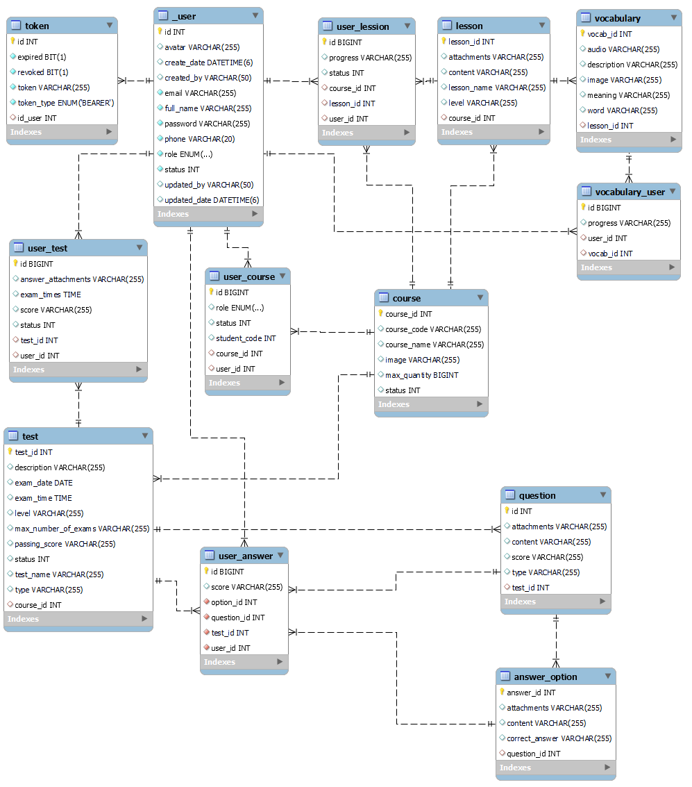

# API English Learning Server

## Overview
This is a server-side API for an English learning application, built using Java and the Spring Framework.

### Key Technologies
- **Java**: The primary language used for building the API.
- **Spring Framework**:
  - **Spring Boot**: For easy configuration and setup of the application.
  - **Spring Security**: To handle authentication and authorization.
  - **Spring MVC**: For building RESTful APIs.

### Additional Features
- **Cloudinary**: Used to store and manage images.
- **MySQL**: Relational database for data persistence.

## API Endpoints

### Auth APIs
- **Login**
  - `POST` [http://localhost:8080/api/v1/auth/authenticate](http://localhost:8080/api/v1/auth/authenticate)


- **Example in Postman**
  1. In the **Body** section, select `raw` and set the format to `JSON`.
  2. Create the JSON body like this:
     ```json
     {
       "email": "tranb@gmail.com",
       "password": "123456"
     }
     ```

- **Sign Up**
    - `POST` [http://localhost:8080/api/v1/auth/register](http://localhost:8080/api/v1/auth/register)


- **Example in Postman**
    1. In the **Body** section, select `raw` and set the format to `JSON`.
    2. Create the JSON body like this:

        - **Example 1 (with role)**:
       ```json
       {
         "fullName": "vinh",
         "email": "vinh@gmail.com",
         "password": "123456",
         "phone": "0123456789",
         "avatar": "23cb8130-f55a-4bb6-b35f-49e0f8c038b2_Ahri_-29-scaled",
         "role": "TEACHER"
       }
       ```

        - **Example 2 (without role, default role is USER)**:
       ```json
       {
         "fullName": "vinh",
         "email": "vinh@gmail.com",
         "password": "123456",
         "phone": "0123456789",
         "avatar": "23cb8130-f55a-4bb6-b35f-49e0f8c038b2_Ahri_-29-scaled"
       }
       ```

  In Example 1, the `role` is explicitly set to `TEACHER`.  
  In Example 2, if the `role` is not provided in the request, it will default to `USER`.


- **Logout**
  - `POST` [http://localhost:8080/api/v1/auth/logout](http://localhost:8080/api/v1/auth/logout)
  

  - **Example in Postman**
  1. In the **Authorization** , select `Bearer Token`.
  2. Enter the access token from login into the box to log out.

- **Refresh Token**
  - `POST` [http://localhost:8080/api/v1/auth/refresh-token](http://localhost:8080/api/v1/auth/refresh-token)


  - **Example in Postman**
  1. In the **Authorization** , select `Bearer Token`.
  2. Enter the login access token into the box to refresh the token.
  

### User APIs
- **Get List of User Information**
  - `GET` [http://localhost:8080/api/v1/users](http://localhost:8080/api/v1/users)

- **Get User Information by ID**
  - `GET` [http://localhost:8080/api/v1/users/{id}](http://localhost:8080/api/v1/users/{id})


- **Get Current User**
    - `GET` [http://localhost:8080/api/v1/users/me](http://localhost:8080/api/v1/users/me)
  

    - **Headers**
    -  | Key            | Value             | Description                       |
    -  |----------------|-------------------|-----------------------------------|
    -  | Authorization  | Bearer {JWT}      | JWT access token from login       |

    - **Response Example**
      ```json
      {
        "id": 1,
        "fullName": "John Doe",
        "email": "johndoe@example.com",
        "phone": "1234567890",
        "avatar": null,
        "status": 1,
        "role": "USER",
        "createDate": "2024-11-15T17:43:59.906+00:00",
        "updatedDate": "2024-11-15T17:43:59.906+00:00"
      }
      ```

### Course APIs
- **Add Course**
  - `POST` [http://localhost:8080/api/v1/courses](http://localhost:8080/api/v1/courses)

  
  - **Example in Postman**
    1. In the **Body** section, select `raw` and set the format to `JSON`.
    2. Create the JSON body like this:
       ```json
        {
           "courseName": "test 3",
           "courseCode": ".",
           "maxQuantity": 40,
           "statusCourse": 1,
           "image": "https://example.com/image.png"
        }
       ```

- **Update Course**
  - `PUT` [http://localhost:8080/api/v1/courses/{id}](http://localhost:8080/api/v1/courses/{id})


  - **Example in Postman**
    1. In the **Body** section, select `raw` and set the format to `JSON`.
    2. Create the JSON body like this:
    3. similar `post`


- **Delete Course**
  - `DELETE` [http://localhost:8080/api/v1/courses/{id}](http://localhost:8080/api/v1/courses/{id})

- **Show Course List**
  - `GET` [http://localhost:8080/api/v1/courses](http://localhost:8080/api/v1/courses)

- **Show Course by ID**
  - `GET` [http://localhost:8080/api/v1/courses/{id}](http://localhost:8080/api/v1/courses/{id})

### Lesson APIs
- **Add Lesson**
  - `POST` [http://localhost:8080/api/v1/lessons](http://localhost:8080/api/v1/lessons)


- **Example in Postman**
  1. In the **Body** section, select `raw` and set the format to `JSON`.
  2. Create the JSON body like this:
     ```json
      {
      "lessonName": "Lesson 3",
      "content": "Lesson content",
      "attachments": "attachment_link",
      "level": "beginner",
      "courseId": 1
      }
     ```

- **Update Lesson**
  - `PUT` [http://localhost:8080/api/v1/lessons/{id}](http://localhost:8080/api/v1/lessons/{id})
  

  - **Example in Postman**
    1. In the **Body** section, select `raw` and set the format to `JSON`.
    2. Create the JSON body like this:
    3. similar `post`


- **Delete Lesson**
  - `DELETE` [http://localhost:8080/api/v1/lessons/{id}](http://localhost:8080/api/v1/lessons/{id})

- **Show Lesson List**
  - `GET` [http://localhost:8080/api/v1/lessons](http://localhost:8080/api/v1/lessons)

- **Show Lesson by ID**
  - `GET` [http://localhost:8080/api/v1/lessons/{id}](http://localhost:8080/api/v1/lessons/{id})

- **Show Lesson by courses id**
  - `GET` [http://localhost:8080/api/v1/lessons/course/{id}](http://localhost:8080/api/v1/lessons/course/{id})

- **Show Lesson by level**
  - `GET` [http://localhost:8080/api/v1/lessons/level/{level}](http://localhost:8080/api/v1/lessons/level/{level})

- **Get lesson by access-token**
    - `GET` [http://localhost:8080/api/v1/lessons/user](http://localhost:8080/api/v1/lessons/user)


    - **Headers**
    -  | Key            | Value             | Description                       |
    -  |----------------|-------------------|-----------------------------------|
    -  | Authorization  | Bearer {JWT}      | JWT access token from login       |

    - **Response Example**
      ```json
        [
            {
                "lessonId": 1,
                "lessonName": "Lesson 1",
                "content": "Lesson content",
                "attachments": "attachment_link",
                "level": 1,
                "courseId": 1,
                "progress": 0.0
                },
            {
                "lessonId": 4,
                "lessonName": "Lesson 3",
                "content": "Lesson content",
                "attachments": "attachment_link",
                "level": 1,
                "courseId": 2,
                "progress": 0.0
            },
            {
                "lessonId": 2,
                "lessonName": "Lesson 2",
                "content": "Lesson content",
                "attachments": "attachment_link",
                "level": 2,
                "courseId": 1,
                "progress": 0.0
            },
            {
                "lessonId": 3,
                "lessonName": "Lesson 3",
                "content": "Lesson content",
                "attachments": "attachment_link",
                "level": 3,
                "courseId": 1,
                "progress": 0.0
            }
        ]
      ```

### UserCourse APIs
- **Add UserCourse**
  - `POST` [http://localhost:8080/api/v1/userCourses/enroll?userId&courseId&studentCode&role&status](http://localhost:8080/api/v1/userCourses/enroll?userId&courseId&studentCode&role&status)


- **Example in Postman**
    1. In the **Body** section, select `raw` and set the format to `JSON`.
    2. Create the JSON body like this:
       ```json
        {
        "userId":2,
        "courseId":7,
        "studentCode":1233,
        "role":"USER",
        "status":"1"
        }
       ```


- **Delete UserCourse**
  - `DELETE` [http://localhost:8080/api/v1/lessons/{id}](http://localhost:8080/api/v1/lessons/{id})

- **Show Lesson UserCourse**
  - `GET` [http://localhost:8080/api/v1/userCourses](http://localhost:8080/api/v1/userCourses)

- **Show UserCourse by ID**
  - `GET` [http://localhost:8080/api/v1/userCourses/{id}](http://localhost:8080/api/v1/userCourses/{id})

- **Show UserCourse by user id**
  - `GET` [http://localhost:8080/api/v1/userCourses/user/{id}](http://localhost:8080/api/v1/userCourses/user/{id})


- **Get Current userCourses**
    - `GET` [http://localhost:8080/api/v1/userCourses/me](http://localhost:8080/api/v1/userCourses/me)


    - **Headers**
    -  | Key            | Value             | Description                       |
    -  |----------------|-------------------|-----------------------------------|
    -  | Authorization  | Bearer {JWT}      | JWT access token from login       |

    - **Response Example**
      ```json
    [
    {
    "id": 2,
    "studentCode": 123,
    "role": "USER",
    "status": 1,
    "courseId": 1,
    "courseName": "test 1",
    "courseCode": ".",
    "statusCourse": 1,
    "maxQuantity": 40,
    "image": "https://example.com/image.png"
    },
    {
    "id": 4,
    "studentCode": 124,
    "role": "USER",
    "status": 1,
    "courseId": 2,
    "courseName": "test 2",
    "courseCode": ".",
    "statusCourse": 1,
    "maxQuantity": 40,
    "image": "https://example.com/image.png"
    }
    ]
      ```


### UserLesson APIs
- **Add User Lesson**
  - `POST` [http://localhost:8080/api/v1/userLesson/startLesson?userId&courseId&lessonId](http://localhost:8080/api/v1/userLesson/startLesson?userId&courseId&lessonId)


- **Example in Postman**
    1. In the **Body** section, select `raw` and set the format to `JSON`.
    2. Create the JSON body like this:
       ```json
        {
        "userId": 2,
        "courseId": 2,
        "lessonId": 3
        }
       ```
     

- **Delete User Lesson**
  - `DELETE` [http://localhost:8080/api/v1/userLesson/{id}](http://localhost:8080/api/v1/userLesson/{id})

- **Show User Lesson**
  - `GET` [http://localhost:8080/api/v1/userLesson](http://localhost:8080/api/v1/userLesson)

- **Show User Lesson by user id**
  - `GET` [http://localhost:8080/api/v1/userLesson/{id}](http://localhost:8080/api/v1/userLesson/{id})

- **Get Current userLesson**
    - `GET` [http://localhost:8080/api/v1/userLesson/me](http://localhost:8080/api/v1/userLesson/me)


    - **Headers**
    -  | Key            | Value             | Description                       |
    -  |----------------|-------------------|-----------------------------------|
    -  | Authorization  | Bearer {JWT}      | JWT access token from login       |

    - **Response Example**
      ```json
    [
    {
    "lessonId": 1,
    "lessonName": "Lesson 1",
    "content": "Lesson content",
    "attachments": "attachment_link",
    "level": "beginner",
    "courseId": 1,
    "progress": "0%"
    },
    {
    "lessonId": 1,
    "lessonName": "Lesson 1",
    "content": "Lesson content",
    "attachments": "attachment_link",
    "level": "beginner",
    "courseId": 1,
    "progress": "0%"
    },
    {
    "lessonId": 1,
    "lessonName": "Lesson 1",
    "content": "Lesson content",
    "attachments": "attachment_link",
    "level": "beginner",
    "courseId": 1,
    "progress": "0%"
    }
    ]
      ```
- **Update userLesson Process**
    - `PUT` [http://localhost:8080/api/v1/userLesson/{id}](http://localhost:8080/api/v1/userLesson/{id})
- **Example in Postman**
    1. In the **Body** section, select `raw` and set the format to `JSON`.
    2. Create the JSON body like this:
       ```json
        {
          "progress": 50.0
        }
       ```


### Vocabulary APIs
- **Add Vocabulary**
  - `POST` [http://localhost:8080/api/v1/vocabularies](http://localhost:8080/api/v1/vocabularies)

- **Example in Postman**
  1. In the **Body** section, select `raw` and set the format to `JSON`.
  2. Create the JSON body like this:
     ```json
      {
      "word": "banana",
      "meaning": "A fruit that is typically green, and yellow.",
      "description": "An banana is a sweet fruit from the banana tree, Malus domestica.",
      "image": "http://example.com/images/banana.jpg",
      "audio": "http://example.com/audio/banana.mp3",
      "lessonId": 1
      }
     ```

- **Delete Vocabulary**
  - `DELETE` [http://localhost:8080/api/v1/vocabularies/{id}](http://localhost:8080/api/v1/vocabularies/{id})

- **Show Vocabulary**
  - `GET` [http://localhost:8080/api/v1/vocabularies](http://localhost:8080/api/v1/vocabularies)

- **Show Vocabulary by id**
  - `GET` [http://localhost:8080/api/v1/vocabularies/{id}](http://localhost:8080/api/v1/vocabularies/{id})

- **Show Vocabulary by word**
  - `GET` [http://localhost:8080/api/v1/vocabularies/word/{word}](http://localhost:8080/api/v1/vocabularies/word/{word})

- **Show Vocabulary by lesson id**
  - `GET` [http://localhost:8080/api/v1/vocabularies/lesson/{lessonId}](http://localhost:8080/api/v1/vocabularies/lesson/{lessonid})

- **Update vocabulary**
  - `PUT` [http://localhost:8080/api/v1/vocabularies/{id}](http://localhost:8080/api/v1/vocabularies/{id})


- **Example in Postman**
  1. In the **Body** section, select `raw` and set the format to `JSON`.
  2. Create the JSON body like this:
  3. similar `post`


### VocabularyUser APIs
- **Add VocabularyUser**
  - `POST` [http://localhost:8080/api/v1/vocabularyUser?userId={?}&vocabId={?}&progress={?}](http://localhost:8080/api/v1/vocabularyUser?userId={?}&vocabId={?}&progress={?})


- **Example in Postman**
    1. In the **Body** section, select `raw` and set the format to `JSON`.
    2. Create the JSON body like this:
       ```json
        {
        "userId": 1,
        "vocabId": 1,
        "progress": "learning"
        }
       ```


- **Delete VocabularyUser**
  - `DELETE` [http://localhost:8080/api/v1/vocabularyUser/{id}](http://localhost:8080/api/v1/vocabularyUser/{id})

- **Show VocabularyUser**
  - `GET` [http://localhost:8080/api/v1/vocabularyUser/all](http://localhost:8080/api/v1/vocabularyUser/all)

- **Show VocabularyUser by id**
  - `GET` [http://localhost:8080/api/v1/vocabularyUser/{id}](http://localhost:8080/api/v1/vocabularyUser/{id})

- **Get Current VocabularyUser**
    - `GET` [http://localhost:8080/api/v1/vocabularyUser/user](http://localhost:8080/api/v1/vocabularyUser/user)


    - **Headers**
    -  | Key            | Value             | Description                       |
    -  |----------------|-------------------|-----------------------------------|
    -  | Authorization  | Bearer {JWT}      | JWT access token from login       |

    - **Response Example**
      ```json
        [
        {
        "id": 1,
        "userId": 1,
        "vocabId": 1,
        "progress": "ok",
        "word": "strawbery",
        "meaning": "A fruit that is typically white, and red."
        },
        {
        "id": 2,
        "userId": 1,
        "vocabId": 1,
        "progress": "ok",
        "word": "strawbery",
        "meaning": "A fruit that is typically white, and red."
        },
        {
        "id": 4,
        "userId": 1,
        "vocabId": 1,
        "progress": "ok",
        "word": "strawbery",
        "meaning": "A fruit that is typically white, and red."
        },
        {
        "id": 5,
        "userId": 1,
        "vocabId": 1,
        "progress": "learning",
        "word": "strawbery",
        "meaning": "A fruit that is typically white, and red."
        }
        ]
        ```

---

## Installation and Setup
1. Clone the repository.
2. Set up a MySQL database and configure the database credentials in `application.properties`.
3. Configure Cloudinary settings in `application.properties` for image storage.
4. Run the application using your preferred IDE or via command line:
   ```bash
   ./mvnw spring-boot:run



